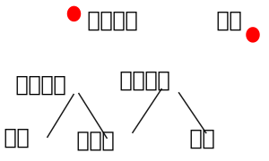

qguan 轻管的核心，应该算是一个比较小的系统核心。
类似 与 java spring

主要提供IOC和AOP，很多人说spring主要的功能就是解耦。

也不能说是不对，个人感觉spring应该是一个系统核心。

IOC 自动创建对象。

AOP  切面编程。

切面编程是建立在面向对象之上的。

不管是面向对象，还是切面编程，他们主要功能都是帮助程序员抽象代码。

这中间其实还会涉及到一些东西，比如设计模式。

配置文件 考虑的本地和网络不一样 希望可以通用
 路径 文件名 类型 程序

数据对象
 名称 对象  上级 程序
 排序 对象  上级 程序
 
 
  ### 大概的实现过程  
    
    这里分为这么几步
	先用前端启动qGuan，注解已经试用过了就是@
	使用babel加载，前端加载编译react文件。
	加载完成之后，直接注入到qGuan里面。
	在注入qGuan的时候，需要添加代理。（*代理*）
	调用的时候，从qGuan里面取对象。
	
	react在修改状态的时候，必然通过代理。
	react在刷新页面的时候，也应该会通过代理。
	
	代理很关键
 
 
 